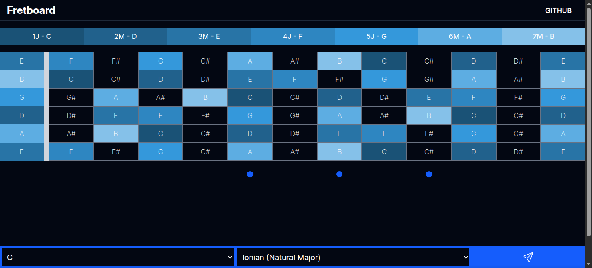

# Fretboard




> Fretboard is a web app that allows you to visualize musical scales on a guitar fretboard. Select a key and a scale to see the notes highlighted on the fretboard.

## Techs

- React
- Vite
- TypeScript
- Tailwind CSS
- Tonal.js
- Tone.js
- React Icons

## Adjustments and improvements

The project is still in development and the next updates are directed to the following tasks:

- [ ] Generate harmonic field

## Installing it

To install it, follow these steps:

```bash
git clone https://github.com/dspedroborges/fretboard
cd fretboard
npm install
```

## Using it locally

To use it locally, follow these steps:

```bash
npm run dev
```

## License

This project is under license. See the file [LICENSE.md](LICENSE.md) for more details.